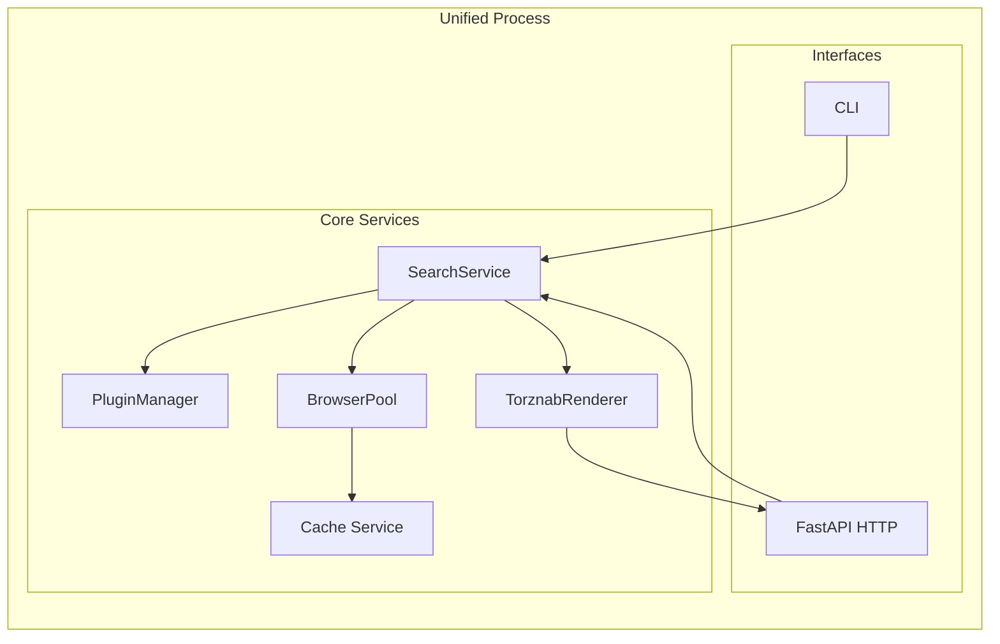

# Scavengarr – Prowlarr‑compatible Torznab/Newznab Indexer Architecture

## System Overview
Scavengarr is a **self‑hosted, container‑ready indexer** that emulates the Torznab/Newznab API used by Prowlarr and other Arr‑applications.  
It scrapes forum‑style and meta‑search sites (via Playwright), normalises the results, and serves them through the Torznab endpoints (`caps`, `search`, `tvsearch`, `movie`, …).  

Key responsibilities:

* **Source acquisition** – HTTP/Playwright‑driven scraping of arbitrary web pages defined by YAML plugins (Cardigann‑style).  
* **Authentication handling** – Basic, form‑login, token, and cookie based auth, configurable per‑plugin.  
* **Result normalisation** – Transform raw HTML tables, JSON feeds, or RSS into the Torznab XML schema.  
* **Cache & scaling** – Redis or disk‑based cache, semaphore‑controlled Playwright browser pool, and optional worker‑process for heavy scraping workloads.  
* **Deployment flexibility** – All‑in‑One Docker image with Supervisor, or a split‑mode where the scraper worker runs in a separate container (K8s‑ready).  

## Core Functions
| Function | Description |
|----------|-------------|
| **Plugin‑driven scraping** | YAML files describe base URL, selectors, pagination, and auth. The engine dynamically builds a Playwright script for each plugin. |
| **Torznab API** | Implements the full set of Torznab endpoints (`caps`, `search`, `tvsearch`, `movie`, `music`, etc.). |
| **Authentication** | Per‑plugin auth strategies (Basic, Form, Token, Cookie) automatically applied before each scrape. |
| **Cache layer** | Redis (preferred) or `diskcache` for request/response memoisation, with configurable TTL. |
| **Browser pool** | Asynchronous semaphore limits the number of concurrent Playwright browsers (default 4). |
| **Result formatting** | Converts scraped items into Torznab‑compatible XML, including mandatory `<torznab:attr>` elements (seeders, leechers, size, etc.). |
| **Health & metrics** | Simple `/healthz` and Prometheus‑compatible metrics endpoint. |
| **CLI & HTTP interfaces** | `scavengarr` CLI for quick debugging and a FastAPI‑served HTTP API for Prowlarr integration. |

## Deployment Modes
Scavengarr can run in two distinct modes:

| Mode | Description |
|------|-------------|
| **Unified (All‑in‑One)** | A single process hosts the FastAPI server **and** the Playwright browser pool. Ideal for development, small‑scale deployments, or a single‑container Docker setup. |
| **Distributed (Worker + Coordinator)** | The FastAPI coordinator runs in one container, while a dedicated **scraper worker** runs in another (or multiple) container(s). Communication uses an HTTP‑based RPC layer. This mode scales horizontally, allowing many workers behind a shared Redis cache and a single coordinator that Prowlarr talks to. |

Both modes are auto‑detected at startup based on the presence of the `SCAVENGARR_WORKER_URL` environment variable.

## Technology Stack
| Layer | Technology |
|-------|------------|
| **Language** | Python 3.12 |
| **Web framework** | FastAPI (ASGI) |
| **Scraping** | Playwright (headless Chromium) |
| **Configuration** | Pydantic + strict schema validation |
| **Cache** | Redis (`aioredis`) **or** `diskcache` |
| **Containerisation** | Docker multi‑stage build, Supervisor for process management |
| **Orchestration** | Docker‑Compose for local dev, Helm chart for Kubernetes |
| **Testing** | Pytest + httpx AsyncClient |
| **Documentation** | MkDocs (auto‑generated from docstrings) |

## Configuration System
Scavengarr loads its configuration **once per process** via `load_config()` in `src/scavengarr/config/__init__.py`.  
Configuration is validated against a **Pydantic BaseModel** (`AppConfig`) and merges the following layers (high → low precedence):

1. **CLI arguments** (`--config`, `--redis-url`, …)  
2. **Environment variables** (`SCAVENGARR_…`)  
3. **User‑provided YAML file** (`config.yaml`, path supplied via CLI or default `./config.yaml`)  
4. **Built‑in defaults** (hard‑coded in `defaults.py`)

Only the explicit YAML file is ever written back. When running in Unified mode, Scavengarr will **populate missing defaults** on start‑up, ensuring a fully‑populated `config.yaml` for later inspection.

## Directory Structure
```
src/
├── scavengarr
│   ├── __init__.py
│   ├── main.py                       # FastAPI entry point, CLI wrapper
│   ├── config
│   │   ├── __init__.py               # load_config()
│   │   └── defaults.py               # default values & schema
│   ├── plugins
│   │   ├── __init__.py
│   │   └── *.yaml                    # Cardigann‑style plugin definitions
│   ├── tools
│   │   ├── __init__.py
│   │   ├── auth.py                   # Auth strategy classes
│   │   ├── browser_pool.py           # Semaphore‑controlled Playwright pool
│   │   ├── cache.py                  # Redis / diskcache wrapper
│   │   ├── torznab_renderer.py       # XML conversion utilities
│   │   └── eval_suite.py             # Simple integration tests for plugins
│   └── services
│       ├── plugin_manager.py         # Load & validate plugins
│       ├── search_service.py         # Core search logic (calls browser_pool)
│       └── health.py                 # /healthz endpoint
├── tests
│   ├── integration
│   │   └── test_api.py               # FastAPI endpoint tests
│   └── unit
│       └── test_browser_pool.py
├── Dockerfile
├── docker-compose.yml
├── pyproject.toml
└── README.md
```

## System Architecture
Scavengarr follows a **layered architecture** where the *Interface layer* (FastAPI/CLI) delegates to a *Tools layer* that coordinates the *Pipeline* (scraping → caching → formatting).  

### Unified Mode (Single Process)



* Direct function calls between components.  
* Real‑time response – no network hop.  
* Simple **single‑container** deployment.

### Distributed Mode (Coordinator + Worker)

```mermaid
graph TD
  subgraph "Coordinator (FastAPI)"
    HTTP_C[FastAPI HTTP] --> RPC_C[RPC Client]
    RPC_C -.->|HTTP/WS| RPC_W
    RPC_C --> EB_C[EventBus (local)]
    EB_C -.->|Updates| HTTP_C
  end

  subgraph "Worker Process"
    RPC_W[RPC Server] --> PLM_W[PluginManager]
    RPC_W --> BP_W[BrowserPool]
    RPC_W --> CS_W[Cache Service]
    RPC_W --> SR_W[SearchService]
    SR_W --> TR_W[TorznabRenderer]
  end

  %% Communication
  RPC_C <==> RPC_W
```

* **Coordinator** handles HTTP requests from Prowlarr, forwards search jobs to the **Worker** via an HTTP‑based RPC layer (tRPC‑like).  
* **Worker** executes heavy scraping, uses Redis cache shared with the coordinator.  
* **EventBus** in the coordinator rebroadcasts job progress (via Server‑Sent Events) to the UI/CLI.  
* Allows horizontal scaling: multiple workers behind a single coordinator.

#### Protocol Auto‑Detection
At startup `scavengarr` checks the environment:

| Condition | Transport |
|-----------|-----------|
| `SCAVENGARR_WORKER_URL` defined | Distributed mode (HTTP + WebSocket) |
| No TTY on `stdin` (e.g. piped from another process) | CLI mode – reads commands from stdio |
| Interactive terminal (TTY) | Unified mode – starts FastAPI server on `0.0.0.0:8000` |

## Core Components

| Component | Responsibility |
|-----------|----------------|
| **PluginManager** | Loads, validates, and caches YAML plugins; exposes `search(plugin_name, query, …)` |
| **Auth** (`auth.py`) | Implements `BasicAuth`, `FormAuth`, `TokenAuth`, `CookieAuth`; each plugin declares its auth type. |
| **BrowserPool** (`browser_pool.py`) | Maintains a semaphore‑limited pool of Playwright browsers; `async with get_page() as page:` pattern. |
| **Cache** (`cache.py`) | Transparent wrapper that first checks Redis (or diskcache), falls back to a live scrape, writes back with configurable TTL. |
| **SearchService** (`search_service.py`) | Orchestrates: auth → cache lookup → (optional) scrape → result normalisation. |
| **TorznabRenderer** (`torznab_renderer.py`) | Serialises Python dicts into Torznab‑compatible XML, handling `<torznab:attr>` for seeds, leechers, size, etc. |
| **Health Service** (`health.py`) | `/healthz` endpoint returning `200 OK` when Redis & Playwright are reachable. |
| **Metrics** (`metrics.py`) | Prometheus endpoint exposing scraper latency, cache hit‑rate, active browser count. |

## Pipeline Flow (Unified & Distributed)

```mermaid
flowchart TD
  A[HTTP Request] --> B[SearchService]
  B --> C{Cache Hit?}
  C -- Yes --> D[Return Cached XML]
  C -- No --> E[Auth (if needed)]
  E --> F[BrowserPool → Playwright]
  F --> G[Scrape & Parse HTML]
  G --> H[Normalize to Torznab dict]
  H --> I[Render XML]
  I --> D
  D --> J[HTTP Response]