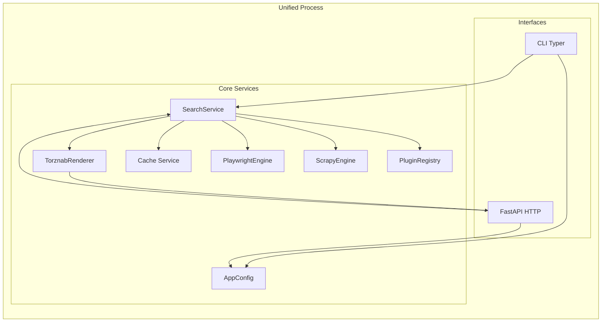
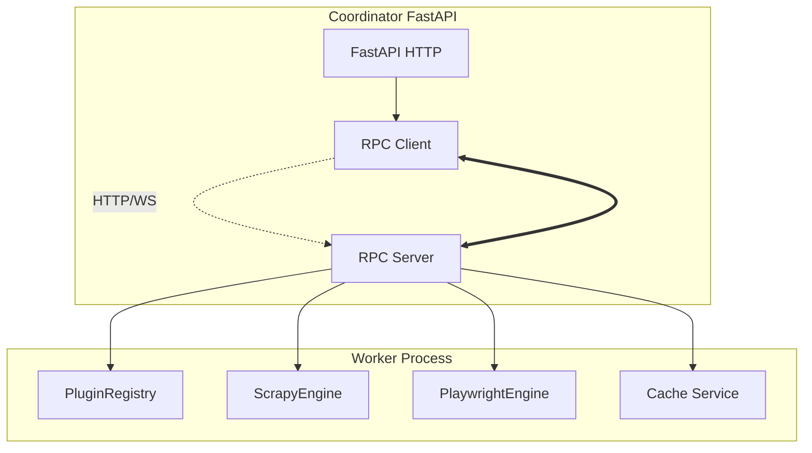
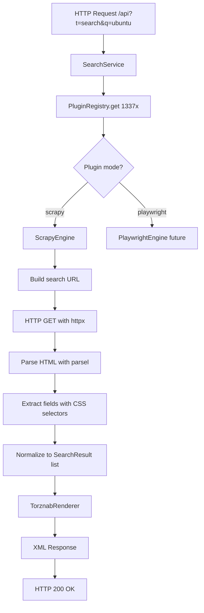

# Scavengarr – Prowlarr‑compatible Torznab/Newznab Indexer Architecture

## System Overview
Scavengarr is a **self‑hosted, container‑ready indexer** that emulates the Torznab/Newznab API used by Prowlarr and other Arr‑applications.  
It scrapes torrent sites via **dual-mode scraping engines** (Scrapy for static HTML, Playwright for JavaScript-heavy pages), normalises results, and serves them through Torznab endpoints (`caps`, `search`, `tvsearch`, `movie`, …).

### Key Responsibilities
* **Plugin-driven scraping** – YAML (declarative) and Python (imperative) plugins define site-specific scraping rules without modifying core code
* **Dual-engine support** – Scrapy engine for fast static HTML scraping, Playwright engine for JS-rendered sites  
* **Authentication handling** – Basic, form-login, token, and cookie-based auth, configurable per-plugin  
* **Result normalisation** – Transform raw HTML tables, JSON feeds, or RSS into the Torznab XML schema  
* **Cache & scaling** – Disk-based cache (`diskcache`) with optional Redis support (future), horizontal scaling via optional worker processes  
* **Type-safe configuration** – Pydantic-based config system with deterministic precedence (CLI → ENV → YAML → defaults)  
* **Deployment flexibility** – All‑in‑One Docker image, or split-mode with separate scraper workers (K8s‑ready)

***

## Core Functions
| Function | Description |
|----------|-------------|
| **Plugin discovery & loading** | `PluginRegistry` auto-discovers `.yaml` and `.py` files from configured directory (`SCAVENGARR_PLUGIN_DIR`), validates schemas (Pydantic for YAML, Protocol for Python), and lazy-loads plugins on first access |
| **Scrapy engine** | Executes YAML plugins with `mode: "scrapy"` using `httpx` (async HTTP) + `parsel` (CSS selectors) for static HTML scraping |
| **Playwright engine** | Executes YAML plugins with `mode: "playwright"` using headless browser for JavaScript-rendered sites (future change) |
| **Python plugin execution** | Imports and executes Python plugins implementing `async def search(query, category) -> list[SearchResult]` for complex scraping logic |
| **Torznab API** | Implements Torznab endpoints (`caps`, `search`, `tvsearch`, `movie`, `music`) via FastAPI |
| **Authentication** | Per‑plugin auth strategies (Basic, Form, Token, Cookie) automatically applied before scraping (future: `add-auth-strategies` change) |
| **Cache layer** | `diskcache` for request/response memoisation with configurable TTL (Redis support optional/future) |
| **Result formatting** | Converts scraped items into Torznab‑compatible XML, including mandatory `<torznab:attr>` elements (seeders, leechers, size) |
| **Health & metrics** | Simple `/healthz` endpoint and structured logging (`structlog`) with JSON/console output |
| **CLI & HTTP interfaces** | `scavengarr` CLI (via Typer) for debugging, FastAPI server for Prowlarr integration |

***

## Technology Stack
| Layer | Technology |
|-------|------------|
| **Language** | Python 3.12 (enforced via `pyproject.toml`) |
| **Web framework** | FastAPI (ASGI) |
| **Scraping** | **Scrapy engine**: `httpx` + `parsel` (CSS selectors)<br>**Playwright engine**: Playwright (headless Chromium, future) |
| **Configuration** | Pydantic Settings (`pydantic-settings`) with strict schema validation |
| **Cache** | `diskcache` (default), Redis optional (future) |
| **Logging** | `structlog` (JSON for prod, console for dev) |
| **CLI** | `typer` |
| **Containerisation** | Docker multi‑stage build, optional Supervisor for multi-process mode |
| **Orchestration** | Docker‑Compose for local dev, Helm chart for Kubernetes (future) |
| **Testing** | Pytest + `httpx.AsyncClient` + `respx` (HTTP mocking) |
| **Tooling** | `ruff` (lint+format), `mypy` (type-check), `pre-commit` hooks |

***

## Configuration System
Scavengarr loads configuration **once per process** via `load_config()` in `src/scavengarr/config/load.py`.  
Configuration is validated against a **Pydantic Settings model** (`AppConfig`) and merges the following layers (high → low precedence):

1. **CLI arguments** (`--config`, `--plugin-dir`, `--log-level`, …)  
2. **Environment variables** (`SCAVENGARR_*` prefix)  
3. **User‑provided YAML file** (path via `--config`, default: `./config.yaml`)  
4. **`.env` file** (optional, loaded via `python-dotenv`)  
5. **Built‑in defaults** (defined in `src/scavengarr/config/defaults.py`)

### Key Configuration Fields (MVP)
```python
class AppConfig(BaseSettings):
    # General
    app_name: str = "scavengarr"
    environment: Literal["dev", "test", "prod"] = "dev"
    
    # Plugins
    plugin_dir: Path = "./plugins"
    
    # HTTP (Scrapy engine)
    http_timeout_seconds: float = 30
    http_follow_redirects: bool = True
    http_user_agent: str = "Scavengarr/0.1.0 (+https://github.com/Strob0t/Scavengarr)"
    
    # Playwright (future)
    playwright_headless: bool = True
    playwright_timeout_ms: int = 30_000
    
    # Logging
    log_level: Literal["DEBUG", "INFO", "WARNING", "ERROR"] = "INFO"
    log_format: Literal["json", "console"] = "console"  # auto: dev=console, prod=json
    
    # Cache
    cache_dir: Path = "./.cache/scavengarr"
    cache_ttl_seconds: int = 3600
```

### Environment Variable Mapping
All config fields use the `SCAVENGARR_` prefix:
- `SCAVENGARR_PLUGIN_DIR`
- `SCAVENGARR_HTTP_TIMEOUT_SECONDS`
- `SCAVENGARR_LOG_LEVEL`
- `SCAVENGARR_CACHE_DIR`

**No side effects**: `load_config()` is pure – it never writes files or creates directories.

***

## Plugin System

### Plugin Types
Scavengarr supports **two plugin formats**:

| Format | Use Case | Validation | Example |
|--------|----------|------------|---------|
| **YAML** | Declarative scraping for static HTML sites with CSS selectors | Pydantic schema (`PluginDefinition`) | 1337x, RARBG, TorrentGalaxy |
| **Python** | Imperative scraping for complex logic (OAuth, JSON APIs, dynamic auth) | Protocol check (`PluginProtocol`) | Private trackers, API-based indexers |

### Plugin Discovery & Loading
1. **Discovery**: `PluginRegistry.discover()` scans `SCAVENGARR_PLUGIN_DIR` for `.yaml` and `.py` files
2. **Lazy-loading**: Files are **not parsed** until first access via `PluginRegistry.get(name)`
3. **Caching**: Parsed plugins are cached in-memory for subsequent requests
4. **Validation**: YAML plugins validated against Pydantic schema, Python plugins checked for `plugin` export and `search` method

### YAML Plugin Schema (Scrapy Mode Example)
```yaml
name: "1337x"
description: "Public torrent tracker"
version: "1.0.0"
author: "scavengarr-team"
base_url: "https://1337x.to"

scraping:
  mode: "scrapy"
  search_path: "/search/{query}/1/"
  selectors:
    row: "table.table-list tbody tr"
    title: "td.name a::text"
    download_link: "td.name a::attr(href)"
    seeders: "td.seeds::text"
    leechers: "td.leeches::text"
    size: "td.size::text"

auth:
  type: "none"

categories:
  2000: "Movies"
  5000: "TV"
```

### Python Plugin Protocol
```python
from scavengarr.plugins.base import SearchResult

class MyCustomPlugin:
    async def search(self, query: str, category: int | None = None) -> list[SearchResult]:
        # Custom scraping logic (e.g., API calls, dynamic auth)
        return [
            SearchResult(
                title="Example Torrent",
                download_link="magnet:?xt=...",
                seeders=10,
                leechers=5,
                size="1.5 GB"
            )
        ]

plugin = MyCustomPlugin()  # REQUIRED export
```

***

## Directory Structure
```
src/
├── scavengarr/
│   ├── __init__.py
│   ├── application/
│   │   └── cli.py                    # Typer CLI entrypoint (start command)
│   ├── config/
│   │   ├── __init__.py
│   │   ├── defaults.py               # Default config values
│   │   ├── schema.py                 # AppConfig Pydantic model
│   │   └── load.py                   # load_config() function
│   ├── plugins/
│   │   ├── __init__.py               # PluginRegistry, SearchResult, PluginProtocol
│   │   ├── base.py                   # SearchResult model, PluginProtocol
│   │   ├── schema.py                 # Pydantic models for YAML plugins
│   │   ├── loader.py                 # load_yaml_plugin(), load_python_plugin()
│   │   ├── registry.py               # PluginRegistry (discovery, lazy-loading, caching)
│   │   └── exceptions.py             # PluginLoadError, PluginValidationError, etc.
│   ├── engines/
│   │   ├── __init__.py
│   │   ├── scrapy_engine.py          # ScrapyEngine (httpx + parsel)
│   │   ├── playwright_engine.py      # PlaywrightEngine (future)
│   │   └── exceptions.py             # ScrapingError, NetworkError, ParsingError
│   ├── services/
│   │   ├── search_service.py         # Orchestrates plugin → engine → renderer
│   │   ├── torznab_renderer.py       # XML conversion utilities
│   │   └── health.py                 # /healthz endpoint
│   ├── logging/
│   │   └── setup.py                  # configure_logging(config: AppConfig)
│   └── api/
│       └── routes.py                 # FastAPI routes (/api?t=search, /api?t=caps)
├── plugins/                           # User-provided plugins (YAML + Python)
│   ├── 1337x.yaml
│   ├── rarbg.yaml
│   └── my-gully.py
├── tests/
│   ├── unit/
│   │   ├── config/
│   │   ├── plugins/
│   │   └── engines/
│   ├── integration/
│   └── fixtures/
│       ├── html/                      # Sample HTML for engine tests
│       └── plugins/                   # Valid/invalid test plugins
├── openspec/
│   └── changes/
│       ├── add-plugin-loader/
│       ├── add-scrapy-engine/
│       └── add-config-system/
├── pyproject.toml
├── ARCHITECTURE.md                    # This file
├── AGENTS.md                          # AI assistant instructions
└── README.md
```

***

## System Architecture

### Unified Mode (Single Process)
**Default mode** for development and small-scale deployments.



* **No worker processes** – all scraping happens in-process  
* **Startup**: Load config → Initialize PluginRegistry → Discover plugins → Start FastAPI  
* **Request flow**: HTTP → SearchService → PluginRegistry.get() → ScrapyEngine.scrape() → TorznabRenderer → HTTP Response

### Distributed Mode (Coordinator + Worker)
**Future enhancement** for horizontal scaling (out of scope for MVP).



* **Coordinator** handles HTTP requests, delegates scraping to workers via RPC  
* **Workers** execute heavy scraping, share Redis cache  
* **Auto-detection**: Presence of `SCAVENGARR_WORKER_URL` env var enables distributed mode  

***

## Core Components

| Component | Responsibility |
|-----------|----------------|
| **AppConfig** (`config/schema.py`) | Typed configuration model (Pydantic Settings), validates all config fields |
| **load_config()** (`config/load.py`) | Merges CLI/ENV/YAML/.env/defaults, returns validated `AppConfig` |
| **PluginRegistry** (`plugins/registry.py`) | Discovers plugins from `plugin_dir`, lazy-loads on access, caches in-memory |
| **load_yaml_plugin()** (`plugins/loader.py`) | Parses YAML, validates with `PluginDefinition` Pydantic model |
| **load_python_plugin()** (`plugins/loader.py`) | Dynamically imports `.py` file, validates `plugin` export and `search` method |
| **ScrapyEngine** (`engines/scrapy_engine.py`) | Executes Scrapy-mode YAML plugins: HTTP GET (`httpx`) → Parse HTML (`parsel`) → Extract fields (CSS selectors) → Return `SearchResult` list |
| **PlaywrightEngine** (`engines/playwright_engine.py`) | Executes Playwright-mode YAML plugins (future change) |
| **SearchService** (`services/search_service.py`) | Orchestrates: Get plugin → Select engine → Execute scrape → Normalize results → Cache (future) |
| **TorznabRenderer** (`services/torznab_renderer.py`) | Serializes `SearchResult` list into Torznab XML with `<torznab:attr>` elements |
| **configure_logging()** (`logging/setup.py`) | Sets up `structlog` based on `AppConfig` (JSON vs console, log level) |
| **Health Service** (`services/health.py`) | `/healthz` endpoint for container health checks |

***

## Scraping Pipeline (Scrapy Engine)



### Scrapy Engine Details
1. **URL Construction**: `base_url` + `search_path.format(query=encoded_query)`  
   Example: `https://1337x.to/search/ubuntu/1/`
2. **HTTP Request**: `httpx.AsyncClient()` with 30s timeout, custom User-Agent
3. **HTML Parsing**: `parsel.Selector(text=response.text)`
4. **Field Extraction**:
   - Row selector: `selector.css("table.results tr.row")`
   - For each row: Extract `title`, `download_link`, `seeders`, `leechers`, `size` using plugin-defined CSS selectors
5. **Result Building**: Create `SearchResult` objects (missing fields → `None`)
6. **Error Handling**: Network errors → `NetworkError`, parsing errors → `ParsingError`, logged with `structlog`

***

## Deployment Modes

| Mode | Trigger | Description |
|------|---------|-------------|
| **Unified (All-in-One)** | Default (no `SCAVENGARR_WORKER_URL`) | Single process hosts FastAPI + all scraping engines. Ideal for Docker single-container setups. |
| **Distributed** | `SCAVENGARR_WORKER_URL` set | FastAPI coordinator delegates scraping to separate worker processes (future enhancement). |

### Running the Application

#### Development Mode (Poetry)
```bash
# Install dependencies
poetry install

# Run with default config (unified mode)
poetry run scavengarr

# Run with custom config
poetry run scavengarr --config custom.yaml --log-level DEBUG

# Run tests
poetry run pytest
```

#### Production Mode (Docker)
```bash
# Build image
docker build -t scavengarr:latest .

# Run with env vars
docker run -p 8000:8000 \
  -e SCAVENGARR_PLUGIN_DIR=/data/plugins \
  -e SCAVENGARR_LOG_FORMAT=json \
  -v ./plugins:/data/plugins \
  scavengarr:latest
```

***

## OpenSpec Integration

### Change-Driven Development
All major features are tracked as **OpenSpec changes** in `openspec/changes/<change-id>/`:
- `proposal.md` – Why this change exists, what changes, impact
- `tasks.md` – Implementation checklist (code, tests, docs)
- `design.md` – Architectural decisions, trade-offs, open questions
- `specs/<capability>/spec.md` – BDD-style requirements (Scenario: WHEN/THEN)

### Active Changes (MVP Roadmap)
1. ✅ `add-config-system` – Type-safe config loading (Pydantic Settings)
2. ✅ `add-plugin-loader` – YAML + Python plugin discovery and validation
3. ✅ `add-scrapy-engine` – Static HTML scraping with httpx + parsel
4. ⏳ `add-playwright-engine` – JavaScript-heavy site scraping
5. ⏳ `add-auth-strategies` – Per-plugin authentication (Basic, Form, Cookie)
6. ⏳ `add-search-service` – Orchestration layer (plugin → engine → renderer)
7. ⏳ `add-torznab-renderer` – XML serialization with `<torznab:attr>`
8. ⏳ `add-fastapi-endpoints` – `/api?t=search`, `/api?t=caps` routes

### Validation
```bash
# Validate all changes before implementation
openspec validate add-config-system --strict --no-interactive
openspec validate add-plugin-loader --strict --no-interactive
openspec validate add-scrapy-engine --strict --no-interactive
```

***

## Logging Strategy
All logs use **structured logging** (`structlog`) with context fields.

### Log Levels
- **DEBUG**: Plugin discovery details, selector matching, HTTP request/response bodies
- **INFO**: Plugin loaded, scraping started/completed, config loaded
- **WARNING**: Selector no match, missing optional fields, slow requests
- **ERROR**: Plugin load failed, network errors, parsing errors

### Example Log Output (JSON format, prod)
```json
{
  "event": "scraping_completed",
  "plugin_name": "1337x",
  "query": "ubuntu",
  "results_count": 25,
  "duration_ms": 342,
  "timestamp": "2026-01-25T22:00:00Z",
  "level": "info"
}
```

### Example Log Output (Console format, dev)
```
2026-01-25 22:00:00 [info     ] scraping_completed plugin_name=1337x query=ubuntu results_count=25 duration_ms=342
```

***

## Testing Approach

### Test Layers
1. **Unit Tests** (`tests/unit/`) – Test individual components in isolation
   - Config precedence, validation
   - Plugin loading (YAML parsing, Python imports)
   - Engine logic (URL building, selector extraction)
2. **Integration Tests** (`tests/integration/`) – Test component interactions
   - Plugin → Engine → Results
   - FastAPI routes → SearchService → TorznabRenderer
3. **End-to-End Tests** (future) – Test full request flow with real plugins

### Test Fixtures
- `tests/fixtures/plugins/` – Valid/invalid YAML and Python plugin samples
- `tests/fixtures/html/` – Sample HTML pages for engine tests
- `pytest` fixtures for temporary config files, env isolation (`monkeypatch`)

### Coverage Requirements
- Minimum 80% line coverage for core modules (`config/`, `plugins/`, `engines/`)
- All OpenSpec scenarios must have corresponding test cases

***

## Security Considerations

### Plugin Sandboxing (Phase 1: Trusted Plugins Only)
- **Assumption**: Only maintainers write plugins (code review before merge)
- **Risk**: Python plugins can execute arbitrary code
- **Mitigation**: Manual code review, no external plugin downloads
- **Future**: Add subprocess isolation or RestrictedPython (Phase 2)

### Configuration Secrets
- **Never log secrets**: `redact_config_for_logging()` masks sensitive fields
- **Environment variables**: Prefer env vars over YAML for secrets (e.g., `SCAVENGARR_AUTH_PASSWORD`)
- **.env files**: Excluded from Git via `.gitignore`

### HTTP Client Security
- **User-Agent spoofing**: Default `User-Agent` mimics browsers to avoid blocks
- **SSL verification**: Always enabled (no `verify=False`)
- **Timeout enforcement**: 30s default to prevent hanging requests

***

## Performance Characteristics

| Metric | Scrapy Engine | Playwright Engine (future) |
|--------|---------------|----------------------------|
| **Startup overhead** | <10ms | ~2s (browser launch) |
| **Request latency** | 100-500ms | 1-3s (JS execution) |
| **Memory per request** | <5MB | ~100MB (browser process) |
| **Concurrency** | 100+ req/s (httpx connection pool) | 4-10 concurrent browsers (semaphore) |
| **Cache hit rate** | 80%+ (with cache enabled) | 60%+ (JS invalidates caching) |

***

## Known Limitations (MVP)

- **No Redis support** – Disk cache only (`diskcache`)
- **No pagination** – Single-page scraping only (add in `add-pagination-support`)
- **No CAPTCHA handling** – Sites with CAPTCHA require Python plugins with custom solvers
- **No hot-reload** – Config/plugin changes require app restart
- **No selector validation** – CSS selector syntax errors detected at runtime (not load-time)

***

## Future Enhancements

### Short-term (Next 3 Changes)
- `add-playwright-engine` – JavaScript-rendered site support
- `add-auth-strategies` – Implement Basic/Form/Cookie auth flows
- `add-search-service` – Unified orchestration layer with cache integration

### Medium-term (Next 6 months)
- `add-pagination-support` – Multi-page result fetching
- `add-rate-limiter` – Per-plugin rate limiting to avoid IP bans
- `add-metrics-endpoint` – Prometheus metrics (cache hit rate, latency percentiles)
- `add-admin-ui` – Web UI for plugin management and testing

### Long-term (1 year+)
- `add-redis-cache` – Optional Redis backend for distributed caching
- `add-worker-mode` – Horizontal scaling with separate worker processes
- `add-plugin-marketplace` – Community plugin repository with sandboxing

***

**Last Updated**: 2026-01-25  
**Author**: Scavengarr Team  
**OpenSpec Version**: Changes `add-config-system`, `add-plugin-loader`, `add-scrapy-engine` integrated