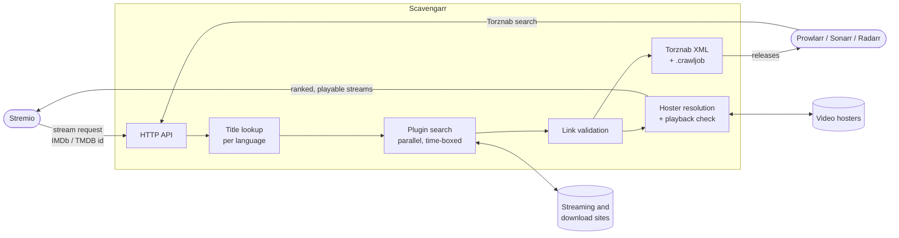

<div align="center">

# Scavengarr

**Self-hosted, German-first streams for Stremio — plus a Torznab indexer for your Arr stack.**

[](LICENSE)
[](pyproject.toml)
[](CHANGELOG.md)
[](docs/features/stremio-addon.md)
[](docs/features/torznab-api.md)

[Quick Start](#quick-start) ·
[Connect your apps](#connect-your-apps) ·
[Configuration](#configuration) ·
[FAQ](#faq--troubleshooting) ·
[Plugins](docs/plugins.md) ·
[Docs](docs/features/README.md)

</div>

---

## What is Scavengarr?

Scavengarr turns streaming and direct-download websites into sources your media apps already understand. You run it on your own machine or server; it searches the sites through small Python plugins, checks what it finds, and hands the results to:

- **Stremio**, as a community addon: open a movie or an episode, and Scavengarr answers with streams that are resolved to real video URLs and checked for playback before they show up. German audio is ranked first, followed by German subtitles and English.
- **Prowlarr, Sonarr, Radarr and other Arr apps**, as a Torznab indexer: every plugin is its own indexer, results carry validated direct-download links, and multi-link releases can be bundled as JDownloader `.crawljob` files.

Scavengarr hosts nothing itself. It is a search-and-verify layer between the sites you choose and the apps you already use.

---

## Table of Contents

- [How it works](#how-it-works)
- [Features](#features)
- [Quick Start](#quick-start)
- [Connect your apps](#connect-your-apps)
- [Configuration](#configuration)
- [Supported sources](#supported-sources)
- [FAQ / Troubleshooting](#faq--troubleshooting)
- [Documentation](#documentation)
- [How Scavengarr is built](#how-scavengarr-is-built)
- [Contributing](#contributing)
- [Disclaimer](#disclaimer)
- [Acknowledgements](#acknowledgements)
- [License](#license)

---

## How it works



1. **Title lookup.** A Stremio request carries an IMDb or TMDB id. Scavengarr looks up the title and year in every language its plugins search in (TMDB, or IMDb/Wikidata without a TMDB key).
2. **Plugin search.** All matching plugins search in parallel within a shared time budget. Each plugin runs its own multi-stage scrape (search page → detail pages → links); slow or broken sites are cut off at the deadline and skipped for a while by a circuit breaker.
3. **Filtering and validation.** Results are matched against the title (sequels and spin-offs are filtered out), narrowed to the requested episode, and their links are checked in parallel.
4. **Stremio: resolution.** Hoster embed links are turned into direct video URLs by 60 hoster resolvers. Every resolved URL gets a playback check (does it actually return video?). One working stream per hoster and language is returned, ranked by language, quality and hoster.
5. **Torznab: packaging.** For the Arr apps, results become Torznab XML with validated links; links behind a captcha or download quota are resolved only when you grab the release.

---

## Features

### Stremio addon

- Streams for movies and series episodes, looked up by IMDb (`tt…`) or TMDB (`tmdb:…`) id
- Hoster links resolved to direct video URLs (MP4 and HLS), with the playback headers Stremio needs
- Playback check: resolved URLs that return an error page or no video are dropped before you see them
- Ranking by language (German audio first by default), quality and hoster reliability
- One working stream per hoster and language (dub and sub both stay): if a hoster's best link is dead, its next link is tried
- Autoplay of the next episode (Stremio's binge watching keeps the language of the current stream)
- Answer deadline: plugins search for up to 30 s from the request start; the answer goes out at 5 resolved streams, when everything is done, or at the latest after 60 s (defaults), so Stremio always gets an answer in time
- Catalogs: trending titles (needs a TMDB API key) and search (TMDB, or IMDb without a key)

### Arr indexer (Torznab)

- Every plugin is a Torznab indexer (`/api/v1/torznab/<plugin>`) for Prowlarr, Sonarr, Radarr and other Arr apps
- Category filtering (movies, TV) and pagination
- Validated download links: dead links are removed before the results reach your apps
- JDownloader `.crawljob` bundles for releases with several links
- Grab-time resolution: links behind a captcha or a download quota are resolved only when a release is grabbed

### Sources and hosters

- 41 plugins for streaming, direct-download and anime sites, mostly German-language — see the [plugin list](docs/plugins.md)
- 60 hoster resolvers (streaming hosters, direct-download hosters, XFS-based hosters)
- Two engines: `httpx` for static pages and APIs, a real browser (Patchright/Playwright) for sites that need JavaScript
- Mirror fallback: plugins try alternative domains when the primary one is down
- Multi-language search: titles are looked up in each plugin's language

### Anti-bot and captchas

- Headful browser that passes Cloudflare Turnstile; clearance cookies survive restarts
- Built-in solvers for ALTCHA proof-of-work and a simple image captcha
- Optional [Byparr](https://github.com/ThePhaseless/Byparr) / FlareSolverr sidecar for sites the built-in browser cannot pass

### Reliability and performance

- Parallel, time-boxed plugin search with a per-plugin circuit breaker (cooldown grows while a site stays down)
- Global concurrency pool with fair-share slots across simultaneous requests, auto-tuned from container CPU and memory limits
- One shared browser process for all browser-based plugins
- Adaptive per-domain rate limiting for outgoing requests, per-IP limit for the API
- Plugin scoring: background probes rank plugins by health and search quality
- Search result cache (diskcache/SQLite or Redis)

### Operations

- Single container with Docker Compose; optional Byparr, Redis and Tempo profiles
- Health, readiness and metrics endpoints (`/api/v1/healthz`, `/api/v1/readyz`, Prometheus `/metrics` with a Grafana dashboard in `docker/`, `/api/v1/stats/metrics`)
- Structured logs (JSON or console) with per-plugin context
- Graceful shutdown that drains in-flight requests
- Configuration via YAML, environment variables or CLI flags

---

## Quick Start

### Docker Compose (recommended)

Requirements: Docker with the Compose plugin, about 2 GB of free RAM (the browser engine is part of the image).

```bash
git clone https://github.com/Strob0t/Scavengarr.git
cd Scavengarr
docker compose up -d --build
```

The first build takes a few minutes (it installs the browser). Then check that it is running:

```bash
curl http://localhost:7979/api/v1/healthz
```

Scavengarr reads `data/config.yaml` (mounted into the container) and the plugins from `plugins/`. Edit the config and run `docker compose restart` to apply changes. In Docker, the log level and format, headless mode and the cache and plugin directories come from environment variables (`Dockerfile.prod`, `docker-compose.yml`), which beat `config.yaml`: change those in `docker-compose.yml`.

**Optional services** (see [`docker-compose.yml`](docker-compose.yml)):

| Profile | Starts | Enable it in Scavengarr |
|---|---|---|
| `solver` | [Byparr](https://github.com/ThePhaseless/Byparr) captcha solver | uncomment `SCAVENGARR_PLAYWRIGHT_SOLVER_URL` |
| `redis` | Redis as cache backend | uncomment `SCAVENGARR_CACHE_BACKEND`, `SCAVENGARR_CACHE_REDIS_URL` and `SCAVENGARR_CACHE_MAX_CONCURRENT` |
| `tracing` | [Grafana Tempo](https://grafana.com/oss/tempo/) for traces on demand ([Observability](docs/features/observability.md)) | uncomment `SCAVENGARR_TELEMETRY_TRACING_ENDPOINT` |

```bash
docker compose --profile solver --profile redis up -d --build
```

**Updating:**

```bash
git pull
docker compose up -d --build
```

### Without Docker (Poetry)

Requirements: Python 3.12–3.14 (the Docker image runs 3.14), [Poetry](https://python-poetry.org/).

```bash
git clone https://github.com/Strob0t/Scavengarr.git
cd Scavengarr
poetry install
poetry run python -m patchright install chromium   # browser for JS-heavy sites
poetry run start --host 0.0.0.0 --port 7979 --config data/config.yaml
```

The browser also needs system libraries: install them once with `sudo poetry run python -m patchright install-deps chromium`. Without Docker the browser runs headful and needs a display: without one it falls back to headless (`browser_headful_no_display` in the log), which fails Cloudflare Turnstile. On a server use `xvfb-run -a poetry run start …`.

---

## Connect your apps

### Stremio

1. Open Stremio → **Addons** → search field (or the addon URL box).
2. Enter the manifest URL:
   ```text
   https://<your-host>/api/v1/stremio/manifest.json
   ```
3. Click **Install**. Open any movie or episode; Scavengarr's streams appear in the stream list.

Stremio only loads addons over **HTTPS** (except on `localhost`). Put Scavengarr behind a reverse proxy with a certificate (Caddy, Traefik, nginx) when you use it from other devices; `docker-compose.yml` trusts the proxy's `X-Forwarded-Proto` from private networks (`FORWARDED_ALLOW_IPS`), so the links Scavengarr builds use `https://`. Details: [Stremio addon](docs/features/stremio-addon.md).

### Prowlarr (and through it Sonarr/Radarr)

Each plugin is added as its own indexer:

1. Prowlarr → **Settings → Indexers → Add Indexer → Generic Torznab**.
2. **URL:** `http://<your-host>:7979/api/v1/torznab/<plugin>` (plugin names: [plugin list](docs/plugins.md)).
3. **API Key:** leave empty.
4. **Categories:** `2000` (Movies), `5000` (TV).
5. **Test**, then **Save**. Prowlarr syncs the indexer to Sonarr and Radarr.

Download plugins deliver direct-download links; send them to JDownloader (e.g. via the `.crawljob` bundles). Details: [Prowlarr integration](docs/features/prowlarr-integration.md), [Torznab API](docs/features/torznab-api.md).

---

## Configuration

Scavengarr works out of the box with [`data/config.yaml`](data/config.yaml). Settings are read in this order (first wins): CLI flags → `SCAVENGARR_*` environment variables (a `--dotenv` file's values included; real variables win over them) → YAML file → defaults.

The settings you are most likely to change:

| Setting (YAML) | Environment variable | Built-in default | What it does |
|---|---|---|---|
| `stremio.plugin_timeout_seconds` | — | `30` | Search budget per Stremio request, counted from the request start |
| `stremio.stream_deadline_seconds` | — | `60` | Latest answer of a Stremio request; it goes out earlier at `stremio.resolve_target_count` (5) streams or when everything is done |
| `stremio.verify_streams` | — | `true` | Drop resolved streams that do not return video |
| `stremio.language_scores` | — | `de` > `de-sub` > `en-sub` > `en` | Language ranking of streams |
| `stremio.max_results_per_plugin` | — | `100` (`data/config.yaml`: `50`) | Results per plugin and Stremio request |
| `tmdb_api_key` | `SCAVENGARR_TMDB_API_KEY` | unset | TMDB key for catalogs and title lookup (IMDb/Wikidata fallback without it) |
| `playwright.solver_url` | `SCAVENGARR_PLAYWRIGHT_SOLVER_URL` | unset | Byparr/FlareSolverr sidecar, e.g. `http://byparr:8191` |
| `playwright.headless` | `SCAVENGARR_PLAYWRIGHT_HEADLESS` | `false` | Headful browser passes Cloudflare Turnstile; needs a display (Xvfb in the image) |
| `cache.backend` | `SCAVENGARR_CACHE_BACKEND` | `diskcache` | `diskcache` or `redis` |
| `cache.search_ttl_seconds` | — | `900` (`data/config.yaml`: `1800`) | How long search results are cached (`0` = off) |
| `http.rate_limit_rps` | `SCAVENGARR_RATE_LIMIT_REQUESTS_PER_SECOND` | `5.0` (`data/config.yaml`: `10.0`) | Starting request rate per site (adaptive) |
| `http.api_rate_limit_rpm` | `SCAVENGARR_API_RATE_LIMIT_RPM` | `120` | Requests per minute per client IP on the API |
| `logging.level` | `SCAVENGARR_LOG_LEVEL` | `INFO` | `DEBUG`, `INFO`, `WARNING`, `ERROR` |

The answer does not wait for the whole search: it goes out once 5 streams resolve. The full reference is in [docs/features/configuration.md](docs/features/configuration.md).

---

## Supported sources

Scavengarr ships 41 plugins: streaming sites (used by the Stremio addon), direct-download sites (served via Torznab) and anime sites, most of them German-language. Six of them use the browser engine, the rest plain HTTP.

The complete, generated list with domains, content type, engine and languages is in **[docs/plugins.md](docs/plugins.md)**. Sites change often. In Stremio searches, a plugin that keeps failing is skipped by the circuit breaker, and a site that does not answer by the health check, until it is back; Torznab requests still reach it.

Want a site that is missing? Plugins are single Python files — see [Contributing](#contributing).

---

## FAQ / Troubleshooting

<details>
<summary><b>Stremio shows no Scavengarr streams at all</b></summary>

- Check that the addon is reachable from the device: open `https://<your-host>/api/v1/stremio/manifest.json` in its browser.
- Stremio needs HTTPS for addons that are not on `localhost` (see [Connect your apps](#stremio)).
- Look at the logs: `docker compose logs -f scavengarr`. Each request logs `stremio_search_complete` with the number of results, matches and streams.
- If results are found but no streams come back, the hosters could not be resolved or failed the playback check (`hoster_resolve_unplayable` in the logs). That happens when every hoster of a title is down.

</details>

<details>
<summary><b>Streams take long to appear</b></summary>

An answer goes out once `stremio.resolve_target_count` streams (5) resolve, or when the search and every resolution are done, at the latest after `stream_deadline_seconds` (60 s by default). For faster answers with fewer streams, lower `resolve_target_count` (e.g. 3) or `stream_deadline_seconds`; for more streams per answer, raise `resolve_target_count`.

</details>

<details>
<summary><b>A stream is listed but does not play</b></summary>

Every stream passed a playback check when it was listed, and Scavengarr resolves the hoster link again when an old stream is played, but the hoster may have removed the file meanwhile, and stream links are kept 7 days. Pick another stream or request the title again. Some hosters bind their video URLs to the IP address that resolved them: the device playing the stream should use the same internet connection as the Scavengarr host.

</details>

<details>
<summary><b>A site is behind Cloudflare or a captcha</b></summary>

The built-in headful browser passes most Cloudflare challenges; in Docker it runs on a virtual display automatically. For sites it cannot pass, start the Byparr sidecar (`--profile solver`) and set `SCAVENGARR_PLAYWRIGHT_SOLVER_URL`. See [Captcha solving](docs/plans/captcha-solving.md).

</details>

<details>
<summary><b>A plugin returns nothing or keeps timing out</b></summary>

Sites move, go down or change their layout. In Stremio searches, the circuit breaker skips a plugin after repeated failures for a while (the pause grows up to one hour while it stays down), and the health check skips a site that does not answer, so a dead site does not slow down your requests; Torznab requests still reach it. Check `/api/v1/stats/metrics` for per-plugin errors and timeouts, and search the issues or open one with the plugin name and the log lines.

</details>

<details>
<summary><b>My whole network gets slow or connections fail while Scavengarr searches</b></summary>

Some home routers treat many new connections to different hosts in a short time like a port scan and block the machine for a minute or two. Scavengarr already limits this (at most 4 link checks per host, one link per hoster at a time during resolution). If it still happens, set `stremio.auto_tune_all` and `stremio.max_concurrent_plugins_auto` to `false` (auto-tuning overwrites the limits at startup), then lower `stremio.max_concurrent_plugins` and `stremio.probe_concurrency`, or run Scavengarr behind a router without that protection.

</details>

<details>
<summary><b>Prowlarr's test fails</b></summary>

- The URL must include the plugin name: `http://<host>:7979/api/v1/torznab/<plugin>`.
- Leave the API key empty.
- A plugin whose site is currently down fails the test; try another plugin to rule out a connection problem.

</details>

<details>
<summary><b>Where is my data stored?</b></summary>

In the `scavengarr-cache` Docker volume (search cache, browser clearance cookies, plugin scores) and in `data/config.yaml`. Scavengarr stores no media.

</details>

---

## Documentation

| Topic | Link |
|---|---|
| All features | [docs/features/README.md](docs/features/README.md) |
| Stremio addon | [docs/features/stremio-addon.md](docs/features/stremio-addon.md) |
| Torznab API | [docs/features/torznab-api.md](docs/features/torznab-api.md) |
| Prowlarr integration | [docs/features/prowlarr-integration.md](docs/features/prowlarr-integration.md) |
| Configuration reference | [docs/features/configuration.md](docs/features/configuration.md) |
| Plugin list | [docs/plugins.md](docs/plugins.md) |
| Plugin system | [docs/features/plugin-system.md](docs/features/plugin-system.md) |
| Hoster resolvers | [docs/features/hoster-resolvers.md](docs/features/hoster-resolvers.md) |
| Link validation | [docs/features/link-validation.md](docs/features/link-validation.md) |
| Plugin scoring | [docs/features/plugin-scoring-and-probing.md](docs/features/plugin-scoring-and-probing.md) |
| Architecture | [docs/architecture/clean-architecture.md](docs/architecture/clean-architecture.md) |
| Changelog | [CHANGELOG.md](CHANGELOG.md) |

---

## How Scavengarr is built

Most of Scavengarr's code was written with AI coding assistants — it is, openly, a largely vibe-coded project. It is not an unreviewed one: every change was directed, reviewed and accepted by an experienced software developer, and the project follows rules that keep the generated code honest:

- **Test-driven development.** Tests come first; the suite has about 5,300 unit, integration and end-to-end tests, plus opt-in live tests against the real sites.
- **Clean Architecture.** Strict layers (domain, application, infrastructure, interfaces) with a dependency rule, ports as protocols and a single composition root.
- **Quality gates on every commit.** `ruff` linting and formatting, type-annotated code, pre-commit hooks and the full test suite before anything is committed.
- **Written plans and measurements.** Larger changes start with a plan in [`docs/plans/`](docs/plans), and performance changes are measured against real requests before and after.
- **Documentation ships with the code.** Behaviour, configuration and architecture changes update the docs and the changelog in the same commit.

The rules the assistants work under are public in [AGENTS.md](AGENTS.md).

---

## Contributing

Contributions are welcome — new plugins and hoster resolvers most of all. Development setup, tests, code style, commit conventions and step-by-step guides are in **[CONTRIBUTING.md](CONTRIBUTING.md)**.

---

## Disclaimer

Scavengarr does not host, store or distribute any content. It only searches websites chosen by its user and reads what those websites publish themselves. The authors are not affiliated with any of the sites or hosters the plugins or resolvers talk to and do not endorse them.

You are solely responsible for how you use Scavengarr: comply with the laws of your country and the terms of the sites you use, and only access content you are allowed to access. The software is provided "as is", without warranty of any kind (see the [license](LICENSE)).

---

## Acknowledgements

Scavengarr builds on the work of many projects:

- [Prowlarr](https://github.com/Prowlarr/Prowlarr), [Sonarr](https://github.com/Sonarr/Sonarr) and [Radarr](https://github.com/Radarr/Radarr) — the Arr ecosystem and the Torznab conventions Scavengarr speaks
- [Stremio](https://www.stremio.com/) and its [addon SDK and protocol](https://github.com/Stremio/stremio-addon-sdk)
- [JDownloader](https://jdownloader.org/) — many hoster resolvers are ports of its open-source hoster plugins
- [Byparr](https://github.com/ThePhaseless/Byparr) and [FlareSolverr](https://github.com/FlareSolverr/FlareSolverr) — captcha and challenge solving
- [Patchright](https://github.com/Kaliiiiiiiiii-Vinyzu/patchright-python) and [Playwright](https://playwright.dev/) — browser automation
- [FastAPI](https://fastapi.tiangolo.com/), [httpx](https://www.python-httpx.org/), [structlog](https://www.structlog.org/), [guessit](https://github.com/guessit-io/guessit), [RapidFuzz](https://github.com/rapidfuzz/RapidFuzz) and [diskcache](https://github.com/grantjenks/python-diskcache)
- [TMDB](https://www.themoviedb.org/) and [Wikidata](https://www.wikidata.org/) for title metadata (this product uses the TMDB API but is not endorsed or certified by TMDB)

---

## License

Scavengarr is licensed under the [GNU General Public License v3.0](LICENSE).
